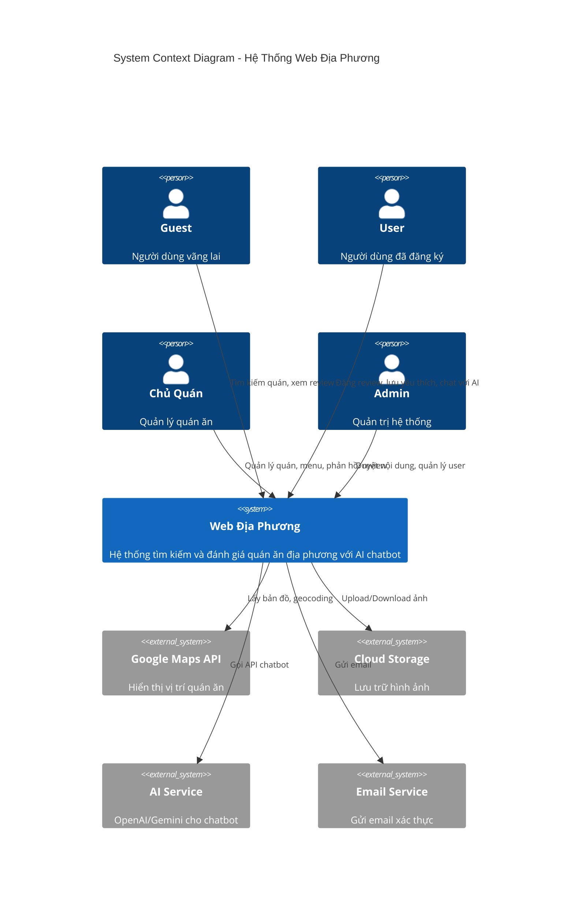
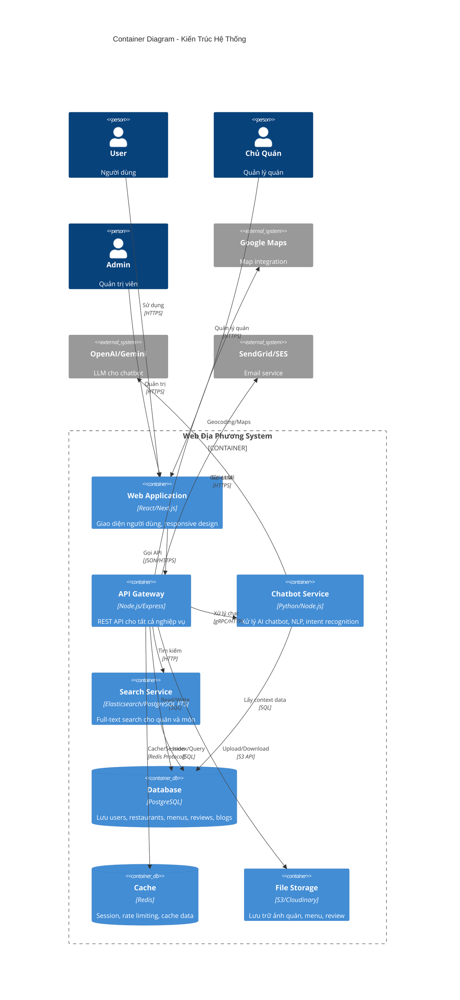
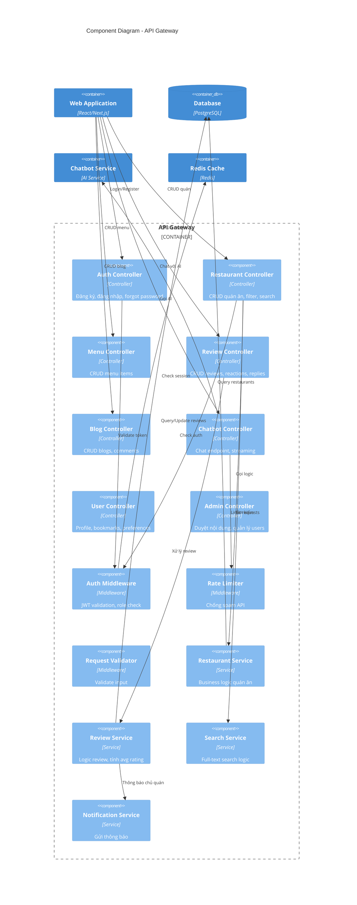
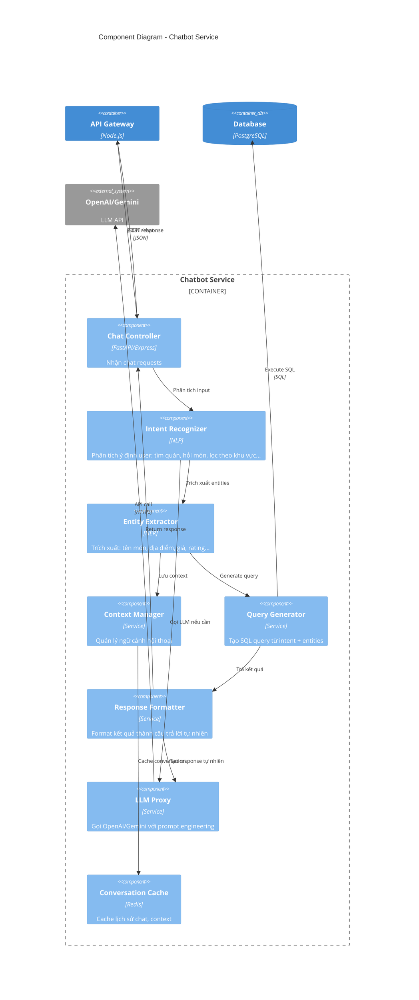
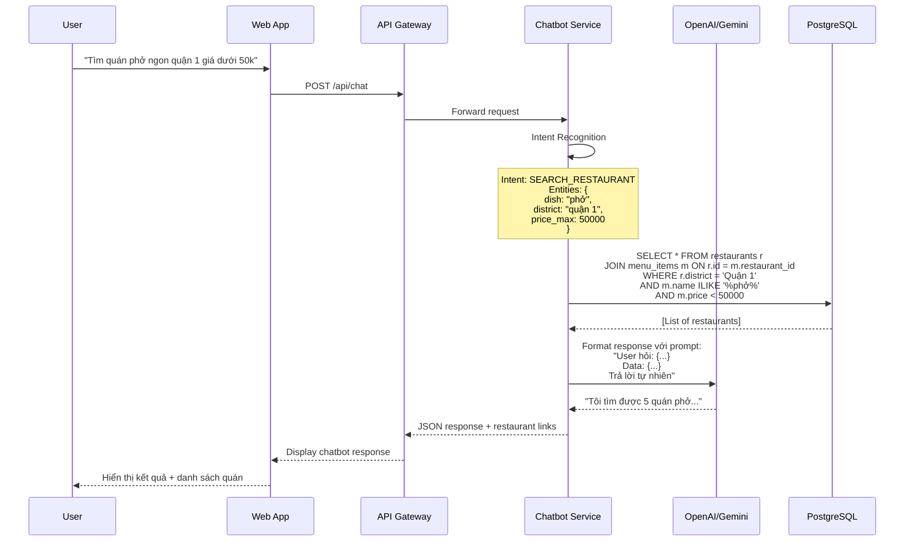

# C4 Diagram - Hệ Thống Web Địa Phương với Chatbot

## Level 1: System Context Diagram

## Level 2: Container Diagram

## Level 3: Component Diagram - API Gateway

## Level 3: Component Diagram - Chatbot Service

## Luồng Xử Lý Chatbot

